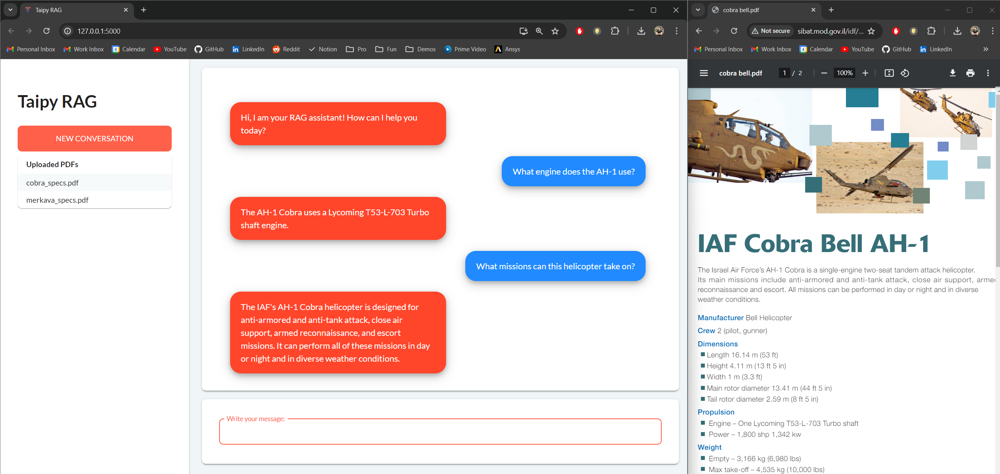

# Taipy RAG Chatbot

<p align="center">
  
</p>

A simple RAG chatbot that allows you to upload PDFs and query the model about the content.

This particular app uses Langchain, Huggingface and Mistral but it can be easily modified to use other models.

## How to Use

**You need a HuggingFace account with an active <a href="https://huggingface.co/settings/tokens" target="_blank">API key</a>**

This application uses some system dependencies like *tesseract* and *poppler*. To simplify development and deployment,
consider using Docker Compose:

Step 1: Clone the `rag` branch of the Git repository.

```bash
git clone -b rag --single-branch https://github.com/Avaiga/demo-gpt-4o.git
```

Step 2: Change directory to the cloned folder.

```bash
cd demo-gpt-4o
```

Step 3: Create a .env file in the root directory with the following content.

```toml
HUGGINGFACEHUB_API_TOKEN=[YOUR_ACCESS_TOKEN]
```

Step 4 (Optional): Add your pdf files to the `pdfs` directory.

Step 5: Build and run the application with Docker.

```bash
docker compose up
```