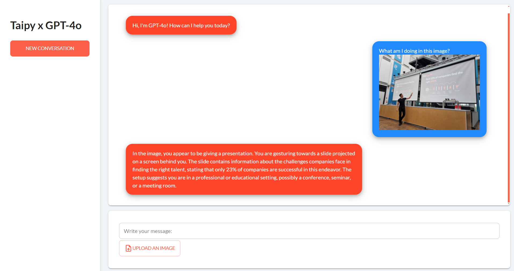

# Taipy Vision Chat Demo

<p align="center">
  
</p>

A simple app to chat with GPT-4o and send images.

This particular app uses OpenAI's GPT-4o API to generate responses to your messages. You can easily change the code to use any other API or model.

## How to Use

**You need an OpenAI account with an active <a href="https://platform.openai.com/api-keys" target="_blank">API key</a>**

1. Clone this repo:

```bash	
git clone https://github.com/Avaiga/demo-gpt-4o.git
```

2. Install dependencies:

```bash
pip install -r requirements.txt
```

3. Create a `.env` file in the root directory with the following content:

```bash
OPENAI_API_KEY=[YOUR_OPENAI_API_KEY]
```

4. Run the app:

```bash
python main.py
```